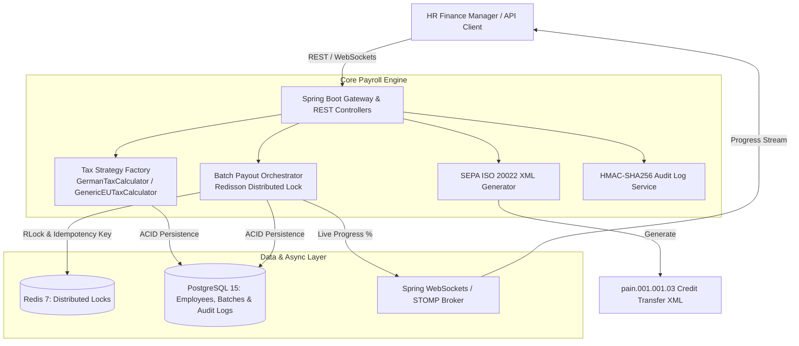

# 💳 PayrollSync — Financial-Grade Payroll & SEPA Reconciliation Engine

<p align="center">
  
  
  
  
  
  
</p>

> **Domain:** HR-Tech + FinTech Fusion  
> **Concept:** Enterprise Microservice for High-Reliability Salary Calculations, Distributed Locking, SEPA XML Generation, and Cryptographic Audit Seals  
> **Author:** Nupoor Dhamal (Senior Java Backend Developer — Banking & Payment Gateways)

---

## 📌 Executive Summary

**PayrollSync** is a high-performance Java microservice built to solve critical payment reliability problems in enterprise payroll management. Drawing inspiration from high-throughput banking systems (Westpac Banking & EGHL Payment Gateways), PayrollSync enforces **Zero Double-Payout Guarantees**, **Idempotent Disbursement Orchestration**, and **Immutable Cryptographic Audit Logging**.

It converts raw employee payroll data into European bank-compliant **SEPA ISO 20022 (`pain.001.001.03`) Credit Transfer XML messages**, streamed live to HR managers over real-time STOMP WebSockets and a modern FinTech dashboard.

---

## 🏗️ System Architecture



---

## Key Engineering Highlights

### 1. 🔒 Zero Double-Payout Guarantee (Distributed Locking + Idempotency)
- Utilizes **Redisson Distributed Locks** (`RLock`) keyed by `lock:payroll_batch:{id}` alongside database uniqueness constraints on `idempotency_key` (`UUID + Period`).
- Even under high concurrency (e.g. multi-node clusters or repeated user requests), batch execution is processed **exactly once**.

### 2. 🧩 Pluggable EU Tax Strategy Pattern
- Extensible `TaxCalculatorStrategy` interface powering country-specific tax engines.
- Includes `GermanTaxCalculator` handling Tax Classes I–VI, Solidaritätszuschlag (5.5%), and Health Insurance (7.3%), alongside a `GenericEUTaxCalculator` fallback.

### 3. 🏦 SEPA ISO 20022 `pain.001.001.03` Credit Transfer Generator
- Generates standard financial XML formats required by European banking gateways (Deutsche Bank, ING, Commerzbank) containing complete `GrpHdr`, `PmtInf`, and `CdtTrfTxInf` payload blocks.

### 4. 🔏 Cryptographic Audit Seals (HMAC-SHA256)
- Every transaction state change (`CREATED` → `CALCULATED` → `PROCESSING` → `COMPLETED`) produces an immutable `audit_logs` record cryptographically signed with **HMAC-SHA256** for non-repudiation and bank audit compliance.

### 5. 🎨 Modern Dark-Mode FinTech Dashboard
- Responsive web dashboard served via Spring Boot (`http://localhost:8080`) featuring Outfit typography, glassmorphism cards, SVG vector icons, and live WebSocket progress bars.

---

## 📂 Project Structure

```
Payroll_sync/
├── pom.xml
├── schema.sql                         # PostgreSQL initialization script
├── application.yml                    # Spring Boot configuration
├── docker-compose.yml                 # App + PostgreSQL 15 + Redis 7 stack
├── Dockerfile                         # Multi-stage Java 21 build
├── README.md
└── src/
    ├── main/
    │   ├── java/com/nupoor/payrollsync/
    │   │   ├── PayrollSyncApplication.java
    │   │   ├── config/                # RedissonConfig, WebSocketConfig
    │   │   ├── controller/            # EmployeeController, PayrollBatchController
    │   │   ├── dto/                   # EmployeeDto, CreateBatchRequest
    │   │   ├── entity/                # Employee, PayrollBatch, PayrollItem, AuditLog
    │   │   ├── exception/             # GlobalExceptionHandler
    │   │   ├── repository/            # Spring Data JPA Repositories
    │   │   ├── service/               # PayrollBatchService, SepaXmlGeneratorService, AuditLogService
    │   │   └── strategy/              # TaxCalculatorStrategy, GermanTaxCalculator, Factory
    │   └── resources/
    │       └── static/                # index.html, styles.css, app.js (FinTech UI)
    └── test/                          # Multi-threaded JUnit 5 Concurrency & Unit Tests
```

---

## ⚡ Quick Start

### Option A: Docker Compose (Full Stack)
Run the full environment (Spring Boot + PostgreSQL 15 + Redis 7):

```bash
docker-compose up --build
```
Access the web dashboard at **[http://localhost:8080](http://localhost:8080)**.

---

### Option B: Local Spring Boot Run
Run locally using Maven:

```bash
./mvnw spring-boot:run
```
Access the web dashboard at **[http://localhost:8080](http://localhost:8080)**.

---

## 🧪 Concurrency & Verification Suite

PayrollSync includes a dedicated multi-threaded test suite verifying distributed locking and idempotency guarantees:

```bash
./mvnw test
```

### Verified Concurrency Test Case:
- **Test File:** `PayrollBatchServiceConcurrencyTest.java`
- **Scenario:** 10 worker threads concurrently invoke `processPayrollBatch(batchId)` on the exact same batch ID.
- **Verification:** **Exactly 1 thread succeeds**, while 9 threads are cleanly rejected due to Redisson distributed lock protection (`BUILD SUCCESS`).

---

## 📡 REST API Documentation

### 1. Register Employee
```http
POST /api/v1/employees
Content-Type: application/json

{
  "employeeCode": "EMP-DE-001",
  "firstName": "Nupoor",
  "lastName": "Dhamal",
  "email": "nupoor@example.com",
  "iban": "DE89370400440532013001",
  "bic": "DBEK234XXX",
  "taxClass": "CLASS_1",
  "baseSalary": 6500.00,
  "countryCode": "DE"
}
```

### 2. Calculate Payroll Batch
```http
POST /api/v1/payroll/batches
Content-Type: application/json

{
  "period": "2026-07",
  "idempotencyKey": "IDEM-2026-07-MAIN"
}
```

### 3. Trigger Idempotent Disbursement (Locked)
```http
POST /api/v1/payroll/batches/{batchId}/process
```

### 4. Download SEPA ISO 20022 XML File
```http
GET /api/v1/payroll/batches/{batchId}/sepa-xml
```

---

## 👩‍💻 Author

**Nupoor Dhamal**  
*Senior Java Backend Developer — Banking, Payment Gateways & Microservices*  
- **Specializations:** Java 21, Spring Boot, Distributed Locking, Microservices Architecture, SEPA ISO 20022, FinTech Integration.
